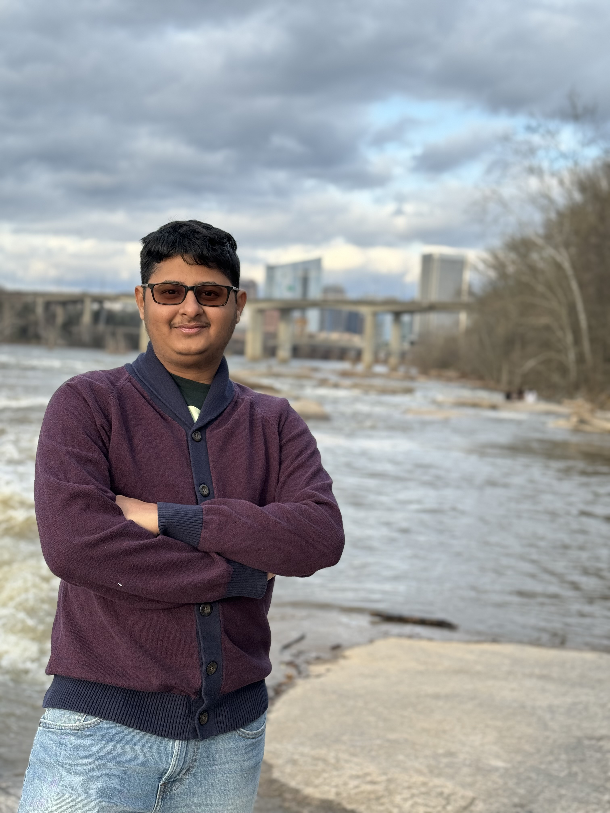

<main>
    <section>
        <h2 class="nospace_heading">About Me</h2>
        
        
Hello and welcome! I am a PhD candidate at MIT, majoring in Computational Science and Engineering <a href="https://cse.mit.edu/" target="_blank">(CSE)</a> and Mechanical Engineering <a href="https://meche.mit.edu/" target="_blank">(MechE)</a>. I work in the <a href="http://mseas.mit.edu/" target="_blank">MSEAS group</a> with <a href="https://meche.mit.edu/people/faculty/pierrel@mit.edu" target="_blank">Prof. Pierre Lermusiaux</a>.

        
My research focuses on developing efficient computational and stochastic tools to forecast and infer ocean and sea ice dynamics from sparse, gappy and noisy observations. I work on generative modeling, scientific deep learning, reduced order modeling, and Bayesian learning to enhance our understanding of Earth's complex fluid dynamical systems. 

        
Check out the <a href="{{ site.url }}/projects">Projects page</a> to see my work.

    </section>
    <!-- -->
    <section>
        <h2 class="nospace_heading">Publications</h2>
        
Narayanan, A., Sadam A., and Lermusiaux P.F.J. (2025) "Guided unconditional and conditional generative models for superresolution and inference of quasi-geostrophic turbulence". Journal of Advances in Modeling Earth Systems. Sub-judice. <a href="https://doi.org/10.48550/arXiv.2507.00719" target="_blank">[doi]</a>

        
Narayanan, A., Sadam A., and Lermusiaux P.F.J. (2025) "Evaluation of analytical turbulence closures for quasi-geostrophic ocean flows with coastal boundaries". OCEANS 2025 IEEE/MTS Great Lakes, Chicago, September 2025. In press.

        
Narayanan, A., and Lermusiaux, P.F.J. (2024). <i>"Stochastic sea ice modeling with the Dynamically Orthogonal equations: Theory and applications"</i>. In preparation.

        
Narayanan, A., and Lermusiaux, P.F.J. (2024). <i>"Neural closure modeling for 2D fluid dynamical systems and geophysical flows"</i>. In preparation.

        <!-- Uncomment if needed -->
        <!-- 
Narayanan, A., Ryu, T., and Lermusiaux, P.F.J. (2023). <i>"Neural closure models for Dynamic Mode Decomposition forecasts"</i>. In preparation.
 -->
        <!-- 
Jalan, A., Gupta, A., Narayanan, A., and Lermusiaux, P.F.J. (2024). <i>"Neural closure models for chaotic dynamical systems"</i>. In preparation.
 -->
        <!-- 
Lermusiaux, P.F.J., Narayanan, A., et al. (2024). <i>"Review of machine learning methods for partial differential equations in fluid and ocean dynamics"</i>. In preparation.
 -->
        
Rajagopal, E., Narayanan, A., Ryu, T., Haley, Jr., Mirabito, C., and Lermusiaux, P.F.J. (2023). <i>"Evaluation of deep learning models towards ocean forecasting"</i>. OCEANS '23 IEEE/MTS Gulf Coast, 25–28 September 2023. <a href="https://ieeexplore.ieee.org/abstract/document/10337380" target="_blank">[doi]</a>

        
Narayanan, A., Rajan, A., Pramanik, R., and Arockiarajan, A. (2019). <i>"A thermodynamically-consistent phenomenological viscoplastic model for hydrogels"</i>. Materials Research Express, 6(8), 085418. <a href="https://iopscience.iop.org/article/10.1088/2053-1591/ab2a49" target="_blank">[doi]</a>

        
Pramanik, R., Narayanan, A., Rajan, A., et al. (2019). <i>"Theoretical modeling and experimental characterization of transversely isotropic hydrogels"</i>. International Journal of Engineering Science, 144, 103144. <a href="https://www.sciencedirect.com/science/article/pii/S0020722518317099" target="_blank">[doi]</a>

        
Rajan, A., Pramanik, R., Narayanan, A., and Arockiarajan, A. (2019). <i>"Mechanics of viscoelastic buckling in slender hydrogels"</i>. Materials Research Express, 6(5), 055320. <a href="https://iopscience.iop.org/article/10.1088/2053-1591/ab0691" target="_blank">[doi]</a>

    </section>
    <section>
        <h2 class="nospace_heading">Conferences</h2>
        
<strong>Presentations</strong>

        
<i>"Physics-inspired neural architectures for forecasting fluid and oceanic flows"</i>, 18th U. S. National Congress on Computational Mechanics, Chicago, Illinois

        
<i>"Stochastic modeling & learning for sea ice dynamics"</i>, 2024 SIAM Conference on Mathematics of Planet Earth, Portland, Oregon.

        
<i>"Probabilistic modeling & Bayesian learning for coupled sea ice-ocean dynamics"</i>, 17th U.S. National Congress on Computational Mechanics, Albuquerque, New Mexico.

        
<i>"Bayesian data assimilation & learning for coupled sea ice-ocean systems"</i>, 2023 SIAM Conference on Mathematical & Computational Issues in the Geosciences, Bergen, Norway.

        
<strong>Posters</strong>

        
<i>"Probabilistic modeling and Bayesian learning for sea ice dynamics"</i>, 2024 Ocean Sciences Meeting, New Orleans, Louisiana.

        
<i>"Neural closure model for Dynamic Mode Decomposition forecasts"</i>, 2021 Model Reduction and Surrogate Modeling Conference, Berlin, Germany.

    </section>
        <section>
        <h2 class="nospace_heading">Fellowships & Awards</h2>
        <ul class="awards-list">
            <li>
                MIT Mechanical Engineering MathWorks Fellowship
                (<a href="https://engineering.mit.edu/fellows/anantha-narayanan-suresh-babu/" target="_blank">2023-2025</a>)
            </li>
            <li>
                MIT Mechanical Engineering Travel Award in Ocean Engineering
                (2025)
            </li>
            <li>
                USACM Travel Award
                (2025)
            </li>
            <li>
                Martin A. Abkowitz International Travel Fellowship in Ocean Engineering
                (2023)
            </li>
            <li>
                Homer A. Burnell MIT School of Engineering Presidential Graduate Fellowship
                (2021-2022)
            </li>
        </ul>
    </section>
</main>
