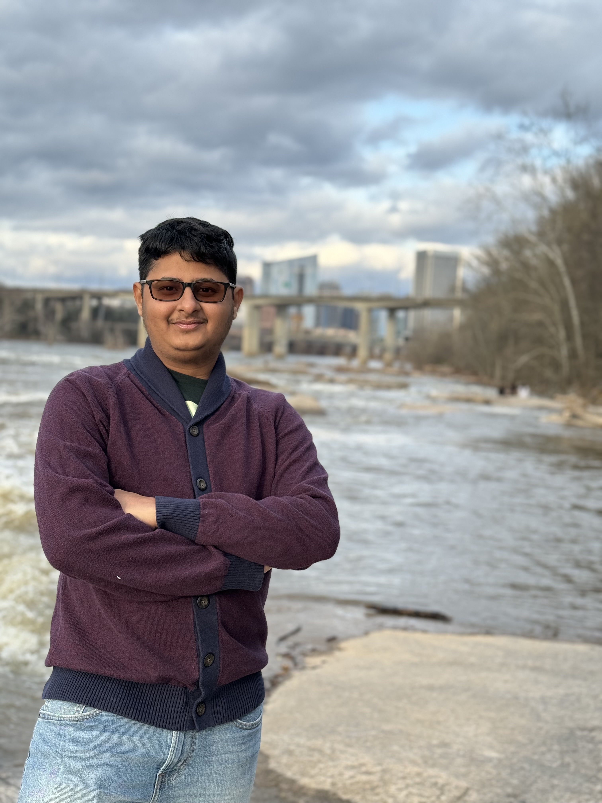

<main>
    <section>
        <h2 class="nospace_heading">About Me</h2>
        
        
Hello and welcome! I am a PhD candidate at MIT, majoring in Computational Science and Engineering <a href="https://cse.mit.edu/" target="_blank">(CSE)</a> and Mechanical Engineering <a href="https://meche.mit.edu/" target="_blank">(MechE)</a>. I work in the <a href="http://mseas.mit.edu/" target="_blank">MSEAS group</a> with <a href="https://meche.mit.edu/people/faculty/pierrel@mit.edu" target="_blank">Prof. Pierre Lermusiaux</a>.

        
My research broadly focuses on developing and applying efficient stochastic computational and deep learning tools for forecasting and inference of ocean and sea ice dynamics from coarse, sparse, and noisy observations. I work on generative modeling, scientific deep learning, reduced order modeling, and Bayesian learning to enhance our understanding of Earth's complex fluid dynamical systems. 

        
Check out the <a href="{{ site.url }}/projects">Projects page</a> to see some of my work.

    </section>
    <!-- -->
    <section>
        <h2 class="nospace_heading">Publications</h2>
        
<strong>Submitted/ In preparation</strong>

        <!-- 
Suresh Babu, A.N., and Lermusiaux, P.F.J. (2024). <i>"Stochastic sea ice modeling with the Dynamically Orthogonal equations: Theory and applications"</i>. In preparation.
 -->
        
Suresh Babu, A.N., Sadam A., and Lermusiaux, P.F.J. (2026). Modified Dynamic Mixed Subgrid-scale Models for Geophysical Flows: Forced Two-Dimensional and β-plane Turbulence. <i>Physical Review Fluids</i>. Sub-judice.

        
Suresh Babu, A.N., Sadam A., and Lermusiaux, P.F.J. (2026). Super-resolution-based stochastic generative closures for forced two-dimensional and β-plane turbulence. In prep.

        
<strong>Peer-reviewed publications</strong>

        
Suresh Babu, A.N., Sadam A., and Lermusiaux P.F.J. (2026) Guided unconditional and conditional generative models for superresolution and inference of quasi-geostrophic turbulence.<i> Journal of Advances in Modeling Earth Systems</i>, 18, e2025MS005324. <a href="https://doi.org/10.1029/2025MS005324" target="_blank">[doi]</a>

        
Suresh Babu, A.N., Sadam A., and Lermusiaux P.F.J. (2025) Evaluation of analytical turbulence closures for quasi-geostrophic ocean flows with coastal boundaries. In <i>OCEANS '25 IEEE/MTS Great Lakes</i>, Chicago, September 2025. <a href="https://doi.org/10.23919/OCEANS59106.2025.11245082" target="_blank">[doi]</a>

        <!-- Uncomment if needed -->
        <!-- 
Suresh Babu, A.N., Ryu, T., and Lermusiaux, P.F.J. (2023). <i>"Neural closure models for Dynamic Mode Decomposition forecasts"</i>. In preparation.
 -->
        <!-- 
Jalan, A., Gupta, A., Suresh Babu, A.N., and Lermusiaux, P.F.J. (2024). <i>"Neural closure models for chaotic dynamical systems"</i>. In preparation.
 -->
        <!-- 
Lermusiaux, P.F.J., Suresh Babu, A.N., et al. (2024). <i>"Review of machine learning methods for partial differential equations in fluid and ocean dynamics"</i>. In preparation.
 -->
        
Rajagopal, E., Suresh Babu, A.N., Ryu, T., Haley, Jr., Mirabito, C., and Lermusiaux, P.F.J. (2023). Evaluation of deep learning models towards ocean forecasting. In <i>OCEANS '23 IEEE/MTS Gulf Coast</i>, September 2023. <a href="https://ieeexplore.ieee.org/abstract/document/10337380" target="_blank">[doi]</a>

        
Pramanik, R., Suresh Babu, A.N., Rajan, A., et al. (2019). Theoretical modeling and experimental characterization of transversely isotropic hydrogels. <i>International Journal of Engineering Science</i>, 144, 103144. <a href="https://www.sciencedirect.com/science/article/pii/S0020722518317099" target="_blank">[doi]</a>

        
Suresh Babu, A.N., Rajan, A., Pramanik, R., and Arockiarajan, A. (2019). A thermodynamically-consistent phenomenological viscoplastic model for hydrogels. <i>Materials Research Express</i>, 6(8), 085418. <a href="https://iopscience.iop.org/article/10.1088/2053-1591/ab2a49" target="_blank">[doi]</a>

        
Rajan, A., Pramanik, R., Suresh Babu, A.N., and Arockiarajan, A. (2019). Mechanics of viscoelastic buckling in slender hydrogels. <i>Materials Research Express</i>, 6(5), 055320. <a href="https://iopscience.iop.org/article/10.1088/2053-1591/ab0691" target="_blank">[doi]</a>

    </section>
    <section>
        <h2 class="nospace_heading">Conferences & Invited Talks</h2>
        
<strong>Invited Talks</strong>

        
Generative models for super-resolution-based inference and subgrid-scale modeling of geophysical turbulence. <i> NOAA Coastal Ocean Modeling Science Seminar, </i> 2026.

        
Guided unconditional and conditional generative models for super-resolution and inference of geophysical flows. <i> NASA Ocean AI Working Group Meeting, </i> 2025.

        
<strong>Conference Presentations</strong>

        
Generative models for super-resolution & inference of Quasi-Geostrophic turbulence and oceanic flows. <i>2026 Ocean Sciences Meeting, Glasgow, Scotland.</i>

        
Physics-inspired neural architectures for forecasting fluid and oceanic flows. <i>18th U. S. National Congress on Computational Mechanics, Chicago, Illinois</i>

        
Stochastic modeling & learning for sea ice dynamics. <i>2024 SIAM Conference on Mathematics of Planet Earth, Portland, Oregon.</i>

        
Probabilistic modeling & Bayesian learning for coupled sea ice-ocean dynamics. <i>17th U.S. National Congress on Computational Mechanics, Albuquerque, New Mexico.</i>

        
Bayesian data assimilation & learning for coupled sea ice-ocean systems. <i>2023 SIAM Conference on Mathematical & Computational Issues in the Geosciences, Bergen, Norway.</i>

        
<strong>Posters</strong>

        
Probabilistic modeling & Bayesian learning for sea ice dynamics. <i>2024 Ocean Sciences Meeting, New Orleans, Louisiana.</i>

        <!-- 
<i>"Neural closure model for Dynamic Mode Decomposition forecasts"</i>, 2021 Model Reduction and Surrogate Modeling Conference, Berlin, Germany.
 -->
    </section>
        <section>
        <h2 class="nospace_heading">Fellowships & Awards</h2>
        <ul class="awards-list">
            <li>
                Wunsch Silent Hoist & Crane Award for Outstanding Graduate Research
                (2026)
            </li>
            <li>
                MIT Mechanical Engineering MathWorks Fellowship
                (<a href="https://engineering.mit.edu/fellows/anantha-narayanan-suresh-babu/" target="_blank">2023-2025</a>)
            </li>
            <li>
                MIT Mechanical Engineering Travel Award in Ocean Engineering
                (2025)
            </li>
            <li>
                USACM Travel Award
                (2025)
            </li>
            <li>
                Martin A. Abkowitz International Travel Fellowship in Ocean Engineering
                (2023)
            </li>
            <li>
                Homer A. Burnell MIT School of Engineering Presidential Graduate Fellowship
                (2021-2022)
            </li>
        </ul>
    </section>
</main>
